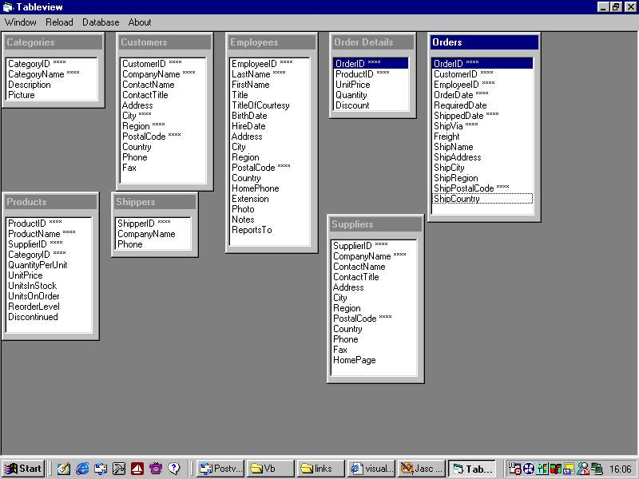

## Tableview

### Description

Browse to your database.

This MDI program opens the database, seeks for tables and puts the fields into new documents. When double clicking a field from a table, the relation between other tables will be shown.

Simple Code ..
 
### More Info
 

             |
---                |---
**Submitted On**   |2002-08-16 16:36:00
**By**             |[Oepi Loepi](https://github.com/Planet-Source-Code/PSCIndex/blob/master/ByAuthor/oepi-loepi.md)
**Level**          |Intermediate
**User Rating**    |4.4 (22 globes from 5 users)
**Compatibility**  |VB 5\.0
**Category**       |[Databases/ Data Access/ DAO/ ADO](https://github.com/Planet-Source-Code/PSCIndex/blob/master/ByCategory/databases-data-access-dao-ado__1-6.md)
**World**          |[Visual Basic](https://github.com/Planet-Source-Code/PSCIndex/blob/master/ByWorld/visual-basic.md)
**Archive File**   |[Tableview1189248162002\.zip](https://github.com/Planet-Source-Code/oepi-loepi-tableview__1-38010/archive/master.zip)

